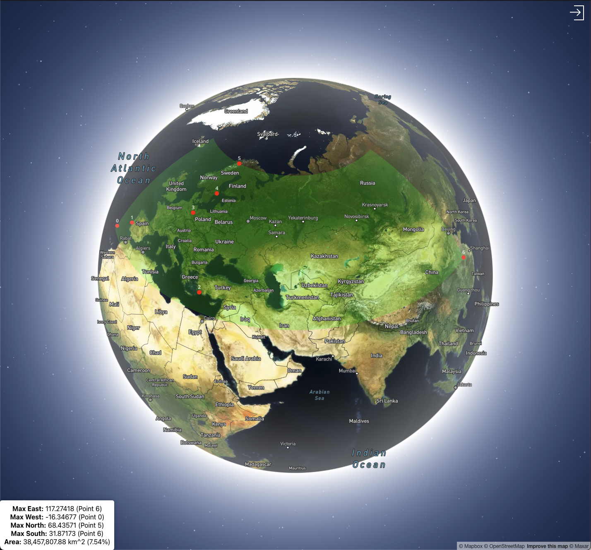

# NSWE Max Coords

> Add points on a globe - get max bound square.

## How to start

### Docker
`docker compose up` in root.

### Manually
`npm start` in both backend and frontend folders.

App accessible on `localhost:3002`.

## How to use

Right click on the globe to add points. The app will calculate the max bound square and display it.

Click on existing points to remove them.

## Security

None. The "login" function allows anyone to enter the app with any username. Just to make it possible to have multiple users on the same instance.